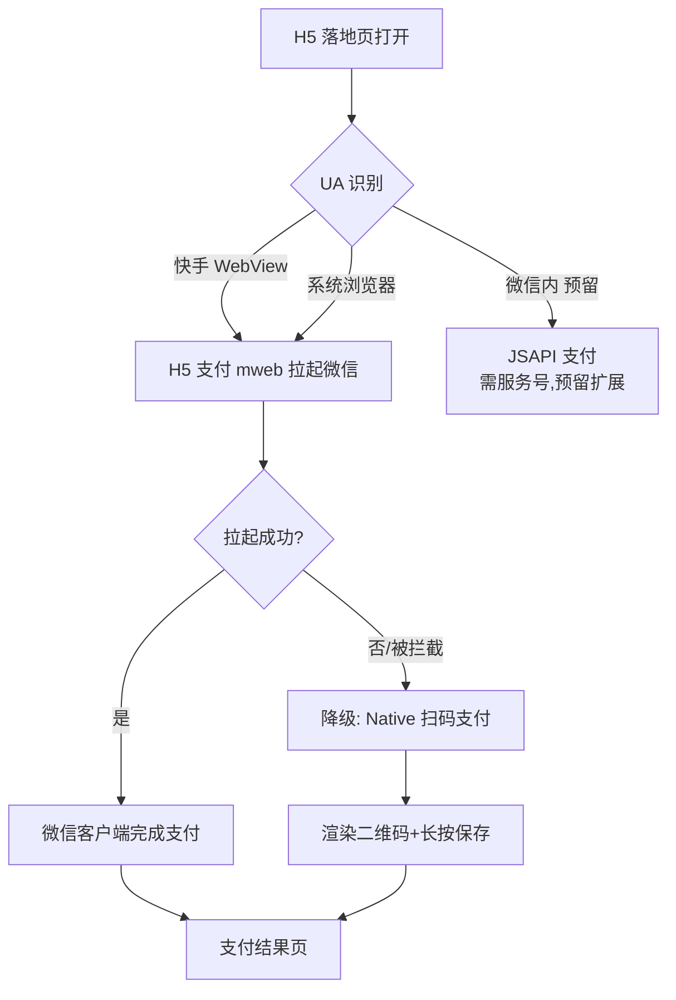
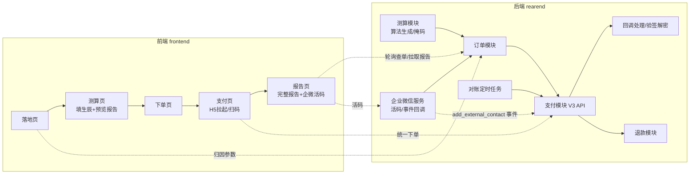
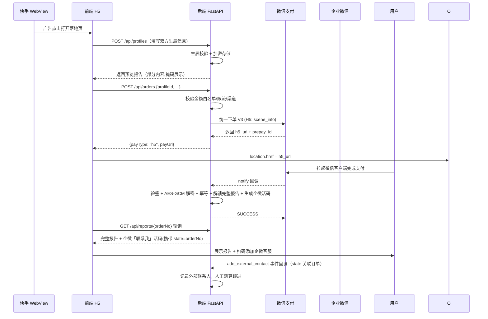
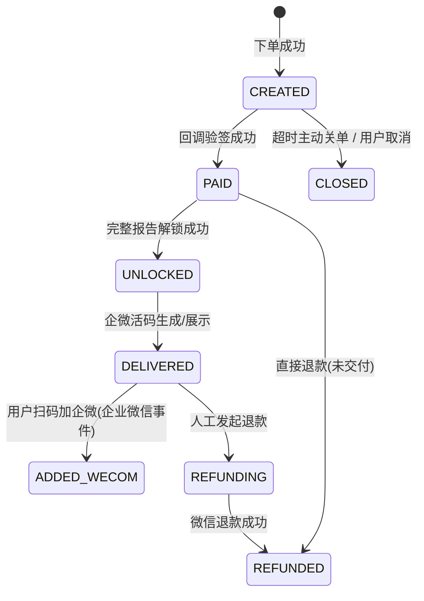
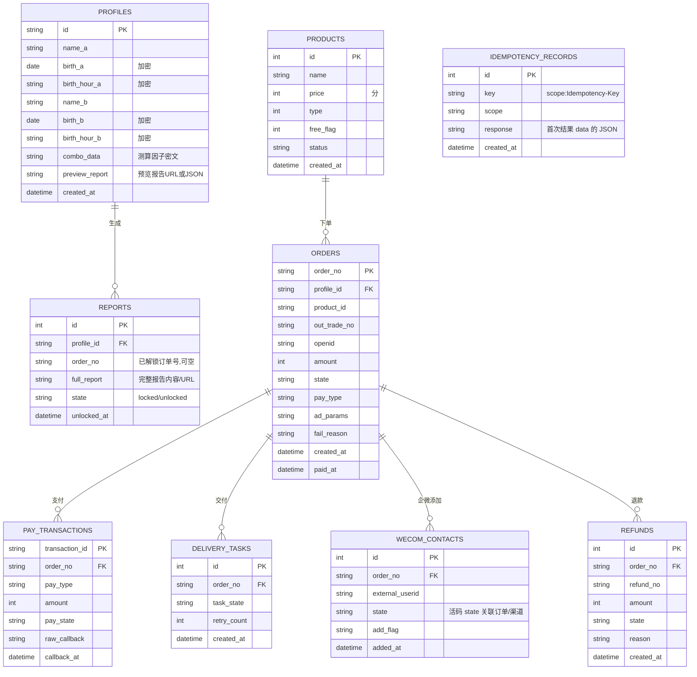

# 项目开发文档

## 1. 项目概述

### 1.1 项目背景

本项目为快手「磁力智投」广告投放的 H5 移动端落地页。用户从快手 App 内广告位点击后，在快手 WebView 中打开营销落地页，通过 **姻缘测算** 引导填写生辰信息，免费获取预览报告，付费后解锁完整报告并添加企业微信进行人工深度测算。

### 1.2 产品定位

- 投放平台：快手磁力智投（快手 App 内 WebView 打开为主）
- 产品形态：**姻缘测算**（免费测算引流 → 付费解锁完整报告 → 企业微信人工测算）
- 商品类型：虚拟服务（测算报告，自动交付 + 人工服务）
- 支付方式：微信支付（非微信环境为主）
- 资质现状：营业执照已有；微信商户号、磁力智投账户、企业微信客户联系权限办理中

### 1.3 核心约束

| 约束 | 说明 |
|---|---|
| 快手 WebView 非微信环境 | 不可使用微信 JSAPI 支付（需服务号与网页授权），支付以 **H5 支付（mweb）为主** |
| 快手 WebView 可能拦截拉起微信客户端 | H5 支付拉起失败时，**降级为 Native 扫码支付**（渲染二维码 + 保存相册提示） |
| 付费交付 = 完整报告 + 人工测算 | 后端算法生成**预览报告**（免费）与**完整报告**（付费解锁）；完整测算由企业微信人工服务完成，报告页展示企微「联系我」活码 |
| 生辰信息属敏感数据 | 加密存储、脱敏展示、接入与审计；报告内容按付费状态掩码控制 |
| 域名 | 必须 HTTPS + ICP 备案（磁力智投落地页审核与微信支付授权域名均要求） |

### 1.4 支付路由策略



> 注：微信内投放与 JSAPI 支付暂不实现，接口设计预留能力（订单状态机与回调已兼容）。

## 2. 技术架构

### 2.1 仓库分工（工作树）

| 工作树 | 分支 | 职责 | 技术栈 |
|---|---|---|---|
| `G:/windows/yycs` | `main` | 主干：规划/规则/文档 + 前后端代码合并目标（monorepo，2026-08-12 起前后端已并入） | - |
| `G:/windows/git-worktree/.../frontend` | `frontend` | H5 前端 | React + Vite + TypeScript |
| `G:/windows/git-worktree/.../rearend` | `rearend` | 后端服务 | Python + FastAPI |

提交约定：前端代码提交至 `frontend` 分支、后端代码提交至 `rearend` 分支；`main` 接受规划/规则/文档类变更，前后端分支经审查通过后合并入 `main`（合并需用户明确要求）。

### 2.2 模块划分



### 2.3 关键时序（免费测算 → 付费 → 企业微信人工）



扫码降级路径：`payType="native"`，前端渲染 `codeUrl` 二维码，用户微信扫一扫支付，后续同一套查询逻辑。

## 3. 环境与资质清单

### 3.1 资质办理（对外，非研发）

| 项 | 用途 | 依赖 | 状态 |
|---|---|---|---|
| 微信支付商户号 | 全部支付模式必需 | 营业执照（已有）+ 对公账户 | 办理中 |
| 快手磁力智投广告账户 | 投放 | 营业执照 | 办理中 |
| 企业微信 + 「客户联系」权限 | 人工测算入口（活码、外部联系人事件） | 企业认证主体与营业执照一致 | 办理中 |
| 域名 HTTPS + ICP 备案 | 落地页/支付回调/H5 支付授权域名/企微回调 | 主体信息 | 办理中 |
| HTTPS 证书 | 生产强制 | 域名 | 域名就绪后 |

### 3.2 研发配置

- 本地开发：FastAPI dev server（`uvicorn --reload`）+ Vite dev server + 本地 HTTPS 代理（微信支付/企微回调调试用内网穿透工具）。
- 后端依赖管理：Python 项目目录内 `python -m venv .venv` 创建虚拟环境，依赖经 `pip install -r requirements.txt` 安装，`.venv/` 不提交。
- 微信沙箱（Sandbox）商户号：本地联调支付下单/回调使用；上线前替换真实商户号。
- 企业微信测试：企微测试企业（开通客户联系），回调 URL 指向本地穿透地址。
- 密钥管理：商户 API 私钥、APIv3 Key、平台证书、企微 Token/EncodingAESKey**禁止入库、禁止进前端**，统一存放环境变量 / 密钥管理服务。
- 生辰数据：数据库加密密钥（AES-256-GCM，KMS/密钥环境）与业务库分离存储。

## 4. 功能需求

### 4.1 前端页面

| 页面 | 职责 | 关键点 |
|---|---|---|
| 落地页 `/` | 营销封面、卖点、信任背书、CTA | 移动端适配（100dvh、safe-area、meta viewport）；快手 WebView 兼容；磁力投放归因参数（`ks_`/`ad_` 参数）透传与落库 |
| 测算页 `/calc` | 填写双方姓名、出生年月日/时辰（表单）+ 免费生成**预览报告**（付费后解锁完整版） | 表单校验；生辰时间换算（公历→农历可选）；预览报告含掩码提示「完整版需付费解锁」；信息提交即落库并生成 `profileId` |
| 下单页 `/order?profileId=` | 确认信息摘要、价格、提交订单 | 展示已填测算信息（脱敏）；生成订单（服务端兜底金额，杜绝前端改价） |
| 支付页 `/pay/:orderNo` | H5 拉起 / Native 扫码 | UA 三态路由；扫码页长按保存提示；拉起失败自动降级 |
| 报告页 `/report/:orderNo` | 完整报告展示 + 企业微信「联系我」活码 + 人工测算说明 | 轮询报告接口；未解锁时提示；展示企微二维码（由后端返回的活码 URL）；「添加到企业微信」按钮（跳转 wecom:// 或扫码） |

### 4.2 后端功能

| 模块 | 功能 | 说明 |
|---|---|---|
| 商品模块 | 测算服务规格（免费/付费档、价格） | 后台可配；金额白名单以此为基准 |
| 测算模块 | 生辰信息校验与加密存储、预览/完整报告算法生成、报告掩码控制 | 预览与完整报告同算法，完整部分付费后返回；算法可后续替换/配置化 |
| 订单模块 | 创建、查询、状态机 | 状态：CREATED → PAID → CLOSED / REFUNDED |
| 支付模块 | 统一下单（H5/Native）、查单、退款 | 微信支付 V3 API |
| 回调模块 | 支付 notify 验签 + 解密 + 幂等 + 解锁报告 | 事务内保证恰好一次解锁（防重复解锁），返回 SUCCESS/FAIL |
| 交付模块 | 完整报告解锁、企微活码生成与展示 | 解锁后调用企微生成带 `state(订单号)` 的「联系我」活码 |
| 企业微信服务 | 「联系我」活码、外部联系人事件回调、企业微信消息通知 | 企微 API（Token 缓存）、事件回调验签（Token + AESKey），`add_external_contact` 事件关联订单记录 |
| 对账模块 | 定时查单补偿 | 每 5 分钟扫描超 30 分钟未回调订单，调用微信查单 |
| 风控模块 | 限流、金额校验、UA/渠道校验、生辰信息风控 | 防改价、防刷单、敏感信息审计 |

### 4.3 订单状态机



## 5. 数据库设计

### 5.1 entities



### 5.2 orders 关键字段说明

| 字段 | 说明 |
|---|---|
| `order_no` | 内部订单号：`YYYYMMDD`（Asia/Shanghai 时区）+ 序列，唯一；时间字段存储统一 UTC、展示时前端转本地 |
| `profile_id` | 关联测算信息（一次性消费，order 与 profile 一对一） |
| `out_trade_no` | 微信商户订单号（取 `order_no`，幂等依赖） |
| `amount` | 金额，单位分（禁止浮点） |
| `ad_params` | 快手磁力投放归因 JSON（`ad_id`、`campaign_id` 等），用于后链路报表 |
| `state` | 状态机见 4.3 |
| `pay_type` | `h5` / `native` / `jsapi`（预留） |

## 6. API 设计

遵循 `API接口规范模板.md`：统一响应 `{code, message, data}`、分页、幂等键 `Idempotency-Key`。本期投放侧接口全部公开（免鉴权，见模板 §1.3），依赖风控策略（限流/金额白名单/渠道校验）防护；回调接口（`/api/pay/notify`、`/api/refund/notify`、`/api/wecom/notify`）按微信/企微协议返回，不遵循统一包装（见模板 §2.10~2.12）。

### 6.1 公开接口

| 接口 | 方法 | 说明 |
|---|---|---|
| `GET /api/products` | GET | 产品列表（含免费/付费档） |
| `GET /api/products/{id}` | GET | 产品详情 |
| `POST /api/profiles` | POST | 提交测算信息 → 返回 `profileId` + **预览报告**（免费） |
| `GET /api/profiles/{profileId}/preview` | GET | 重新获取预览报告（不含敏感完整内容） |
| `POST /api/orders` | POST | 创建订单（绑定 profileId、产品、渠道参数、支付方式），返回 `{orderNo, payType, payUrl/codeUrl}` |
| `GET /api/orders/{orderNo}` | GET | 订单详情/状态（前端轮询） |
| `POST /api/orders/{orderNo}/close` | POST | 关单（超时/取消） |
| `GET /api/orders/{orderNo}/report` | GET | **付费后**返回完整报告 + 企微「联系我」活码（含 `state`）；未支付返回预览掩码 |
| `GET /api/orders/{orderNo}/delivery` | GET | 交付状态/企微添加状态 |

### 6.2 回调接口

- `POST /api/pay/notify`（微信支付回调：验签 + AES-GCM 解密 → 状态更新 → 解锁报告 + 生成企微活码 → 返回 `SUCCESS`）
- `POST /api/refund/notify`（退款结果回调，预留）
- `POST /api/wecom/notify`（企业微信事件回调：Token + EncodingAESKey 验签解密，处理 `add_external_contact` 等事件，返回 `echostr`/`success`）

### 6.3 创建订单请求示例

```json
POST /api/orders
Idempotency-Key: 8f14e45f-8b32-4d3a-9c1d-7e2b3a4c5d6e

{
  "profileId": "P2026080900123",
  "productId": 1,
  "paymentMethod": "auto",      // auto | h5 | native
  "adParams": {"ad_id": "x", "creative_id": "y", "campaign_id": "z"},
  "ua": "Mozilla/5.0 ..."
}
```

响应：

```json
{
  "code": 0,
  "data": {
    "orderNo": "S20260809001",
    "amount": 9900,
    "payType": "h5",
    "payUrl": "https://wx.tenpay.com/cgi-bin/mmpayweb/bin/checkmweb..."
  }
}
```

### 6.4 报告接口响应示例（付费已解锁）

```json
{
  "code": 0,
  "data": {
    "orderNo": "S20260809001",
    "state": "DELIVERED",
    "report": { "title": "紫微缘分配对报告", "contentUrl": "/static/reports/S20260809001.html" },
    "wecom": {
      "addWay": "contact_way",          // 企业微信「联系我」活码/链接
      "qrcodeUrl": "https://qywx...",
      "state": "S20260809001",
      "note": "已生成专属客服码,扫码添加后由人工为您深度测算"
    }
  }
}
```

### 6.5 错误码补充

| code | HTTP | 含义 |
|---|---|---|
| 10006 | 429 | 超出限频（通用，见模板 §4.2） |
| 12001 | 400 | 金额校验失败（防改价） |
| 12002 | 409 | 订单已支付 |
| 12003 | 409 | 订单状态不允许操作 |
| 12004 | 502 | 支付拉起失败，请使用扫码 |
| 12005 | 400 | 回调验签失败 |
| 13001 | 404 | 产品不存在/已下架 |
| 14001 | 422 | 测算信息无效（生辰/姓名校验失败） |
| 14002 | 403 | 报告未解锁 |

> 错误码体系见 `API接口规范模板.md` §3.4/§4.3：模块号 12=订单/支付、13=商品、14=测算/报告；通用错误码（10001~10006、50000）不再重复列举。

## 7. 微信支付 V3 对接细节

### 7.1 凭据与配置

- 商户 API 私钥 `apiclient_key.pem`：仅服务端
- 平台证书/公钥：验证微信回调
- APIv3 Key：解密回调 resource 的 `AES-256-GCM`
- 配置 `wxpay` 段：`mchid`、`appid`（预留）、`notify_url`、`refund_notify_url`、证书路径

### 7.2 统一下单（核心点）

- H5：`scene_info` 必填 `payer_client_ip`，返回 `h5_url`；**微信内环境禁止 H5 支付**（UA 判断拦截）
- Native：返回 `code_url`（二维码内容）
- 金额单位 **分**，`out_trade_no` 幂等：同单号重复下单返回原单结果

### 7.3 回调处理（安全重点）

1. 验签：回调 HTTP 头 `Wechatpay-Signature` + 平台证书验签，失败返回 `FAIL`
2. 解密：`resource` 字段 AES-GCM 解密出明文 JSON（transaction_id、amount.total、out_trade_no、trade_state）
3. 幂等：`order_no` 状态已 PAID 直接返回 `SUCCESS`（不重复解锁）
4. 一致性：以微信返回的 `amount.total` 为准与订单金额比对，不一致即告警拒绝
5. 返回 `{"code":"SUCCESS"}`，否则微信将重试

### 7.4 查单与对账

- 主动查单：`GET /v3/pay/transactions/out-trade-no/{out_trade_no}`（mchid + 时间窗口）
- 对账任务：每 5 分钟扫描 `CREATED` 且创建超 30 分钟订单 → 微信查单 → 按结果补种状态 + 告警

## 8. 企业微信「客户联系」对接细节

### 8.1 前置与配置

- 企业微信已认证，开通 **「客户联系」** 权限（含通讯录、外部联系人 API 读权限）
- 配置 `wecom` 段：`corpid`、`contact_secret`、回调 `token`、`encoding_aes_key`、回调 URL `https://<域名>/api/wecom/notify`
- 企微 API Token 缓存（`gettoken` 2 小时有效期）

### 8.2 活码生成（支付交付阶段）

- 支付回调成功（PAID → DELIVERED）时调用企业微信 `get_contact_way`：
  - `type=2`（临时二维码类，服从有效期）
  - `state=订单号`（如 `S20260809001`）用于**用户专属归因**，最多 30 字符
  - 返回 `config_id` 与 `qr_code` 链接 → 存入 `WECOM_CONTACTS` / 随 `GET /api/orders/{orderNo}/report` 返回
- 活码可配置多个客服成员（多人可用），后期人工测算由客服侧跟进

### 8.3 事件回调（加好友归因）

1. 企微向 `POST /api/wecom/notify` 推送 `change_external_contact` 事件（`AddExternalContact`）
2. 验签：`msg_signature` + token + aes_key 解密出明文 XML
3. `state` 字段与 `WECOM_CONTACTS.state` 匹配 → 更新订单/客户记录（`added_at`、`external_userid`）
4. 幂等：同 `external_userid` 重复事件不重复写
5. 事件处理失败返回非 `success`，企微会重推（最多 3 天）

### 8.4 关联与对账

- `WECOM_CONTACTS` 与订单一对多（一单可被多客添加，一般一对一）
- 日报汇总：付费订单数、已加企微人数、未加人数 → 渠道归因报表

## 9. 安全与隐私设计

| 项 | 措施 |
|---|---|
| 防改价 | 服务端按产品表价格创建订单；回调金额与订单按分精确比对 |
| 幂等 | `Idempotency-Key`；订单号唯一；报告解锁事务内 CAS（`UPDATE ... WHERE state='PAID'`） |
| 限流 | 每 IP+UA 组合限速（下单类 10 次/分钟，其余 60 次/分钟，可调），超限返回 HTTP 429 + `10006`；异常订单（金额越界/频率）日志告警 |
| 防刷 | 磁力 adParams 校验 + 渠道率监控；黑名单表 |
| 密钥 | 商户私钥、APIv3Key、企微 Token/AESKey 仅存服务端，禁止日志打印、禁止前端可见 |
| 回调安全 | 验签不过拒绝，返回非 SUCCESS；仅 HTTPS |
| 敏感数据 | 生辰信息 AES-GCM 加密存储（密钥独立于数据库）；接口响应脱敏（生日只返年月/掩码）；审计日志记录访问 |
| 报告访问控制 | 报告内容接口强制校验订单支付状态与 profile 归属，未解锁返回掩码，杜绝越权 |

## 10. 测试与验收

| 阶段 | 内容 |
|---|---|
| 单元测试 | 金额换算、签名/验签、测算算法边界（跨年/闰月/性别）、状态机（pytest） |
| 沙箱支付 | 微信沙箱商户号统一下单/回调、1 分钱真实支付 |
| 真机矩阵 | 快手 App（iOS/Android）、快手极速版、系统浏览器 4 端完整链路 |
| 降级测试 | 模拟 WebView 拦截拉起 → 自动切换扫码页 + 保存相册 |
| 并发测试 | 同订单回调去重（并发 10 次回调只解锁一次）；同 profile 重复下单防重 |
| 企微链路 | 活码生成、扫码添加 → `add_external_contact` 事件 → 订单关联；事件重复推送幂等 |
| 安全测试 | 掩码越权拦截（未付费/他人 profile 拉取完整报告）；生辰数据加密落库验证 |
| 磁力智投审核 | 落地页主体一致、备案号、素材合规，用投放后台的落地页检测工具验证 |

## 11. 上线检查清单

- [ ] 微信商户号已开通、沙箱切正式、证书就位
- [ ] 企业微信已认证、客户联系权限开通、回调 URL/Token/AESKey 配置完成并验证
- [ ] 域名备案完成，HTTPS 强制跳转，支付回调域名加白
- [ ] H5 支付授权域名已配置且能拉起微信（非快手环境验证）
- [ ] 磁力智投落地页提交审核并通过
- [ ] 对账任务与告警接入监控（企业微信应用通知）
- [ ] 退款流程人工复核台就绪（虚拟服务退款人工审核）
- [ ] 前端按 UA 优先 H5、失败降级扫码，降级开关可配置（Feature Flag）
- [ ] 测算报告算法校验：预览/完整版内容一致且掩码正确
- [ ] 回滚方案：关接口网关、停支付路由；数据可回溯（订单报表全量不可删除）